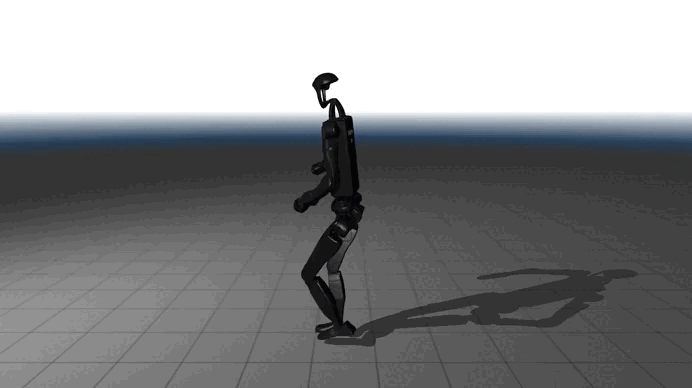

# video2robot

Convert any video of a person moving into robot motion data.
```
[Video / Prompt] → PromptHMR → SMPL-X pose → GMR IK → robot_motion.pkl
```

## Demo — Huayno Dance (Peruvian Folk)

| Original | Unitree H1-2 | Unitree G1 |
|:---:|:---:|:---:|
|  |  |  |

---

## Pipeline
```
Video (.mp4)
    └─► PromptHMR          # monocular 3D human pose estimation (SMPL-X)
            └─► GMR IK     # motion retargeting to robot joint space
                    └─► robot_motion.pkl
```

Supports **video files** or **text prompts** as input. Output is robot-agnostic — retarget to any supported humanoid without reprocessing the video.

---

## Requirements

- NVIDIA GPU · CUDA 12.8 (tested on RTX 3050 6 GB)
- Miniconda
- Git

---

## Installation

### 1. Clone
```bash
git clone --recursive https://github.com/josue99999/video2robot_h1_2.git
cd video2robot_h1_2
```

### 2. GMR environment (robot retargeting)
```bash
conda create -n gmr python=3.10 -y && conda activate gmr
pip install -e .
pip install -e third_party/GMR/
```

### 3. phmr environment (pose extraction)
```bash
conda create -n phmr python=3.10 -y && conda activate phmr
cd third_party/PromptHMR && pip install -e .
conda install -c conda-forge ffmpeg -y
```

#### CUDA extensions

> If `nvcc` doesn't point to CUDA 12.8, prefix each `pip install` with `PATH=/usr/local/cuda-12.8/bin:$PATH`.
> Export CUDA headers from pip-installed NVIDIA packages:
> ```bash
> export CPATH=$(python -c "import site,glob,os; dirs=[p for sp in site.getsitepackages() for p in glob.glob(os.path.join(sp,'nvidia/*/include'))]; print(':'.join(dirs))")
> ```
```bash
# From third_party/PromptHMR/
cd pipeline/droidcalib
PATH=/usr/local/cuda-12.8/bin:$PATH pip install lietorch/
PATH=/usr/local/cuda-12.8/bin:$PATH pip install . \
  --config-settings="--build-option=--nvcc-extra-args=-gencode arch=compute_86,code=sm_86"
cd ../../..

pip install 'git+https://github.com/facebookresearch/detectron2.git' --no-build-isolation
pip install sam2 torch_scatter --no-build-isolation
pip install xformers --index-url https://download.pytorch.org/whl/cu128 --no-deps
```

#### Runtime library path
```bash
mkdir -p $CONDA_PREFIX/etc/conda/activate.d/
cat > $CONDA_PREFIX/etc/conda/activate.d/torch_libs.sh << 'EOF'
#!/bin/sh
TORCH_LIB="$CONDA_PREFIX/lib/python3.10/site-packages/torch/lib"
NVIDIA_LIB="$CONDA_PREFIX/lib/python3.10/site-packages/nvidia/cuda_runtime/lib"
export LD_LIBRARY_PATH="$TORCH_LIB:$NVIDIA_LIB:${LD_LIBRARY_PATH:-}"
EOF
```

#### Patch chumpy (numpy ≥ 1.24 compatibility)
```bash
python -c "
import site, os
path = os.path.join(site.getusersitepackages(), 'chumpy/__init__.py')
content = open(path).read()
old = 'from numpy import bool, int, float, complex, object, unicode, str, nan, inf'
new = '''from numpy import nan, inf
import numpy as _np
bool=_np.bool_; int=_np.int_; float=_np.float64
complex=_np.complex128; object=_np.object_; unicode=_np.str_; str=_np.str_'''
open(path,'w').write(content.replace(old,new)); print('chumpy patched OK')
"
```

### 4. Body models

#### SMPL-X (auto-download)
```bash
cd third_party/PromptHMR
conda run -n phmr python -m gdown --folder -O ./data/ \
  https://drive.google.com/drive/folders/1JU7CuU2rKkwD7WWjvSZJKpQFFk_Z6NL7
conda run -n phmr python -m gdown -O ./data/body_models/smplx/ \
  1v9Qy7ZXWcTM8_a9K2nSLyyVrJMFYcUOk
cd ../..
```

#### SMPL (requires free registration at smpl.is.tue.mpg.de)
```bash
mkdir -p third_party/PromptHMR/data/body_models/smpl
unzip -j SMPL_python_v.1.0.0.zip 'smpl/models/*' \
  -d third_party/PromptHMR/data/body_models/smpl/

# Build gender-neutral model
conda run -n phmr python << 'EOF'
import pickle, numpy as np, scipy.sparse
d = 'third_party/PromptHMR/data/body_models/smpl'
f = pickle.load(open(f'{d}/basicModel_f_lbs_10_207_0_v1.0.0.pkl','rb'), encoding='latin1')
m = pickle.load(open(f'{d}/basicmodel_m_lbs_10_207_0_v1.0.0.pkl','rb'), encoding='latin1')
to_np = lambda x: x.toarray() if scipy.sparse.issparse(x) else np.array(x)
n = {k: (to_np(f[k])+to_np(m[k]))/2
     for k in ['v_template','posedirs','weights','weights_prior','shapedirs']}
n['J_regressor'] = (to_np(f['J_regressor'])+to_np(m['J_regressor']))/2
n['J_regressor_prior'] = (to_np(f['J_regressor_prior'])+to_np(m['J_regressor_prior']))/2
for k in ['f','kintree_table','bs_style','bs_type','J']:
    n[k] = to_np(f[k]) if hasattr(f[k],'__iter__') else f[k]
pickle.dump(n, open(f'{d}/SMPL_NEUTRAL.pkl','wb'), protocol=2)
print('SMPL_NEUTRAL.pkl OK')
EOF
```

#### Symlinks
```bash
ln -s $(pwd)/third_party/GMR/assets/body_models/smplx \
      third_party/PromptHMR/data/body_models/smplx
```

> SMPL-X model files must be in `third_party/GMR/assets/body_models/smplx/`.  
> Download from https://smpl-x.is.tue.mpg.de if missing.

### 5. PromptHMR checkpoints
```bash
cd third_party/PromptHMR && conda run -n phmr bash scripts/fetch_data.sh && cd ../..
```

---

## Usage

Scripts handle conda environment switching automatically.

### Full pipeline
```bash
# From video (use --static-camera on GPUs with <10 GB VRAM)
python scripts/run_pipeline.py --video /path/to/video.mp4 --static-camera

# Specify robot
python scripts/run_pipeline.py --video /path/to/video.mp4 --static-camera --robot unitree_g1
python scripts/run_pipeline.py --video /path/to/video.mp4 --static-camera --robot unitree_h1_2

# Resume existing project (skips completed steps)
python scripts/run_pipeline.py --project data/my_project --static-camera

# From text prompt (requires GOOGLE_API_KEY)
python scripts/run_pipeline.py --action "The subject walks forward." --static-camera
```

### Retarget to multiple robots

Once `smplx.npz` is generated, retarget without re-running pose extraction:
```bash
python scripts/convert_to_robot.py --project data/my_project --robot unitree_g1   --all-tracks
python scripts/convert_to_robot.py --project data/my_project --robot unitree_h1_2 --all-tracks
```

### Visualization
```bash
# MuJoCo interactive viewer
python scripts/visualize.py --project data/my_project --robot --robot-type unitree_g1
python scripts/visualize.py --project data/my_project --robot --robot-type unitree_h1_2

# Browser-based viewer with mesh + video overlay (port 8789)
python scripts/visualize.py --project data/my_project --robot-viser --robot-type unitree_h1_2

# SMPL-X pose viewer
python scripts/visualize.py --project data/my_project --pose
```

### Record output videos
```bash
python scripts/visualize.py --project data/my_project --pose              --record
python scripts/visualize.py --project data/my_project --robot --robot-type unitree_h1_2 --record
python scripts/visualize.py --project data/my_project --robot --robot-type unitree_g1   --record
```

Output: `video_pose.mp4`, `video_robot_<type>.mp4` inside the project folder.

---

## Output format
```python
# robot_motion.pkl
{
    "fps":        30.0,
    "robot_type": "unitree_g1",
    "num_frames": 300,
    "root_pos":   np.ndarray,  # (N, 3)   root XYZ position
    "root_rot":   np.ndarray,  # (N, 4)   root quaternion (xyzw)
    "dof_pos":    np.ndarray,  # (N, DOF) joint angles [rad]
}
```

---

## Supported robots

| Robot | ID | DOF |
|---|---|---|
| Unitree G1 | `unitree_g1` | 29 |
| Unitree G1 + hands | `unitree_g1_with_hands` | — |
| Unitree H1 | `unitree_h1` | 19 |
| Unitree H1-2 | `unitree_h1_2` | 27 |
| Booster T1 | `booster_t1` | 23 |
| Booster T1 29DOF | `booster_t1_29dof` | 29 |
| Booster K1 | `booster_k1` | — |
| Fourier N1 | `fourier_n1` | — |
| Stanford Toddy | `stanford_toddy` | — |
| EngineAI PM01 | `engineai_pm01` | — |
| Kuavo S45 | `kuavo_s45` | — |
| Galaxea R1 Pro | `galaxea_r1pro` | — |

---

## Credits

- [PromptHMR](https://github.com/yufu-wang/PromptHMR) — monocular 3D human pose estimation
- [GMR](https://github.com/YanjieZe/GMR) — motion retargeting to humanoid robots

## License

Core code: MIT · PromptHMR: non-commercial research only.
